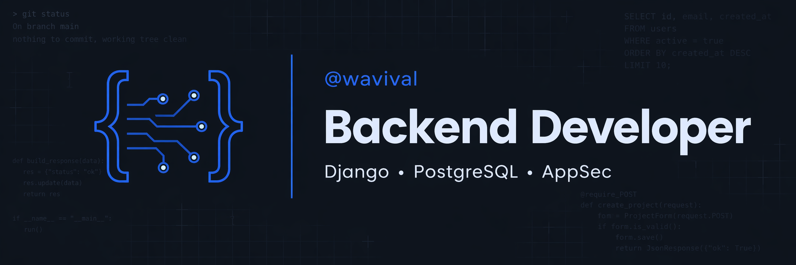
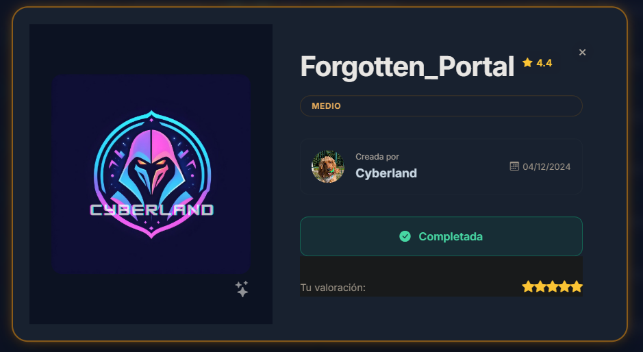

<h1 align="left">
  
  Valentina Ramírez • @wavival
</h1>

Currently developing **TerraCore**, a B2B SaaS platform for the agroindustrial sector in Colombia, built with Python, Django REST Framework, PostgreSQL, and React.

Trained in cybersecurity (Diploma in Cybersecurity • EAFIT • SOC Operations), on a clear path toward **Application Security and DevSecOps**.

## ∆ Lab & Prod

### NullBreach *(coming soon)*

This is a full-stack cybersecurity assistant built to demonstrate end-to-end product development, from system design and secure backend architecture to AI integration and polished frontend execution.

The app allows users to ask cybersecurity questions powered by Claude API, submit code snippets for automated OWASP vulnerability detection, and manage a full query history, all behind a JWT-authenticated, production-grade REST API.

Every decision in this project reflects a security-first mindset: the stack that protects the app is the same stack the app talks about.

Used tools: `Python` `Django REST Framework` `PostgreSQL` `Astro` `React` `TypeScript` `JWT` `Claude API`

### Penetration Testing Lab • Forgotten Portal

A hands-on penetration testing lab built on DockerLabs. Full attack chain from zero to root: reconnaissance, enumeration, vulnerability exploitation, and privilege escalation.

Methodology follows PTES (Penetration Testing Execution Standard) with findings mapped to MITRE ATT&CK framework. Includes both a full technical report and an executive report written for non-technical stakeholders.

[Writeup](https://blog.luminaw.co/forgotten-portal-pentesting-dockerlabs/) • [Repository](https://github.com/wavival/forgotten-portal-writeup)

Used tools: `NMAP` `Gobuster` `Netcat` `Python` `Base64` `GFTOBins` `MITRE ATT&CK` `PTES` `DockerLabs` `Linux`

## ∆ Find me

