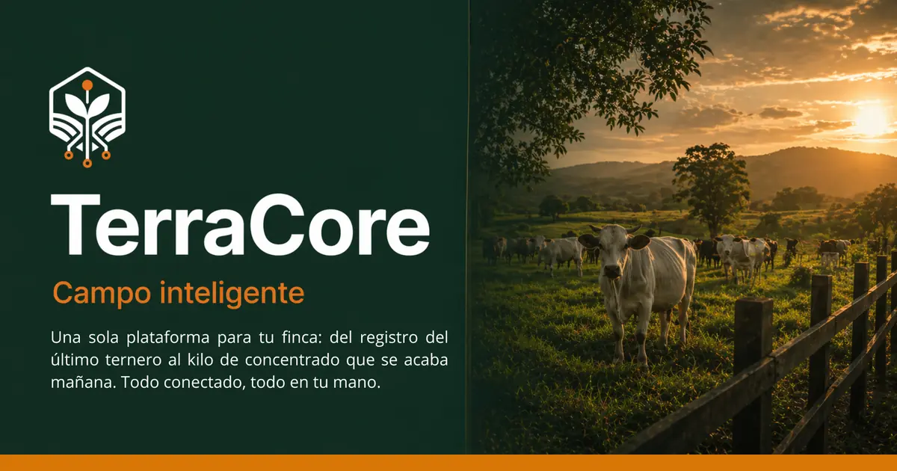
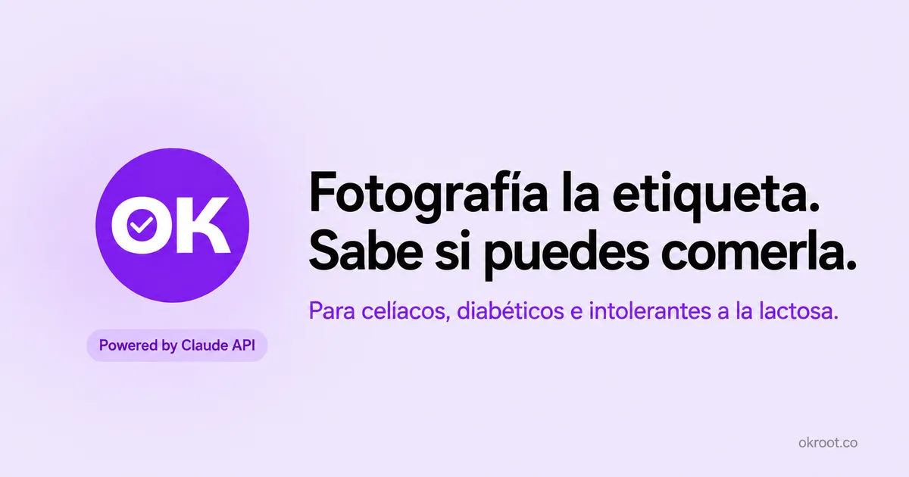
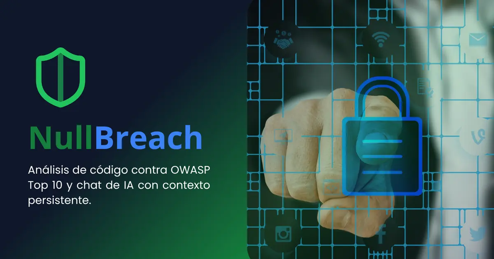
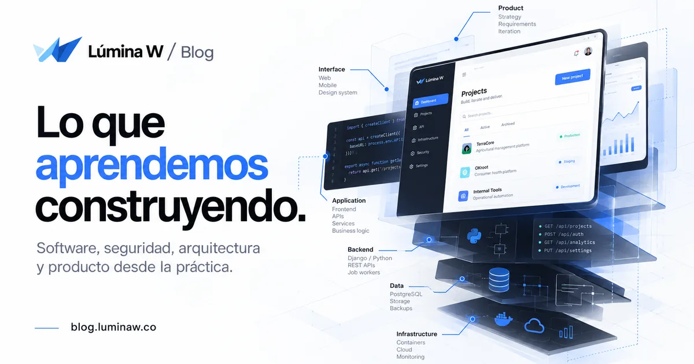
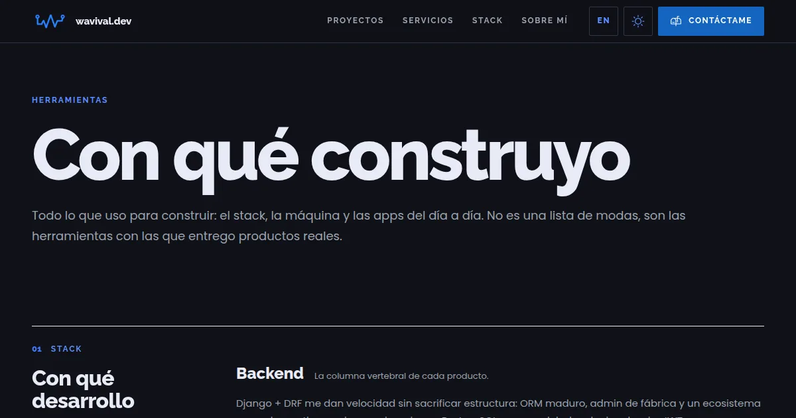
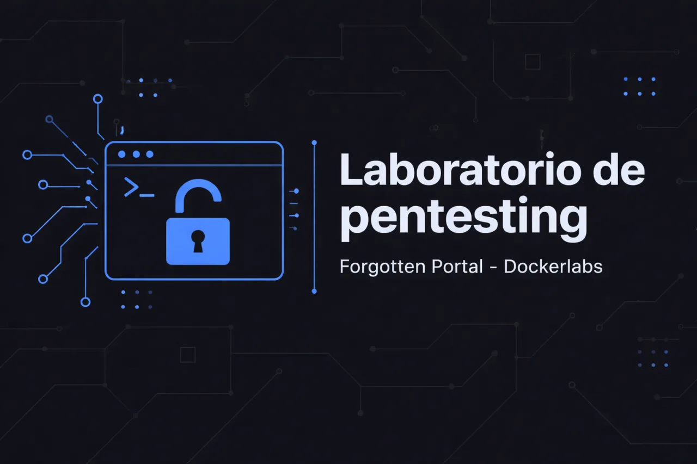

<h1 align="left">
  
  Valentina Ramírez • @wavival
</h1>

Currently developing **TerraCore**, a B2B SaaS platform for the agroindustrial sector in Colombia, built with Python, Django REST Framework, PostgreSQL, and React.

> Trained in cybersecurity (Diploma in Cybersecurity • EAFIT • SOC Operations), on a clear path toward **Application Security and DevSecOps**.

## Contents

- [Projects](#projects)
  - [TerraCore PWA](#terracore-pwa)
  - [OKroot PWA](#okroot-pwa)
  - [NullBreach](#nullbreach)
  - [Blog Lúmina W](#blog-lúmina-w)
  - [wavival.dev](#wavivaldev)
  - [Forgotten Portal](#forgotten-portal)
- [Contact](#contact)

## Projects

### TerraCore PWA

Multi-user, offline-first PWA for Colombian farms. It tracks livestock, crops, inputs, production, animal health and finances in a single system where every action in one module updates the others. It replaces notebooks, spreadsheets and WhatsApp groups as the operational tool, with roles and permissions per site.

[Live app](https://app.terracoreapp.co) • [Case study](https://www.wavival.dev/proyectos/terracore) • [Design prototype](https://terracore-prototype.netlify.app/)

Used tools: `Django` `DRF` `PostgreSQL` `Celery` `Redis` `JWT` `React` `TypeScript` `Dexie` `Tailwind CSS`

### OKroot PWA

Offline-first food safety PWA for people with celiac disease, diabetes or lactose intolerance. Users photograph a product label and Claude AI analyzes it against their restrictions to say whether it is safe to eat.

[Live app](https://app.okroot.co/) • [Landing](https://okroot.co/) • [Case study](https://www.wavival.dev/proyectos/okroot)

Used tools: `React` `TypeScript` `Vite` `Tailwind CSS` `Dexie` `Django` `DRF` `PostgreSQL` `Claude API` `PWA`

### NullBreach

Open-source application security assistant. It runs OWASP-aligned code analysis with severity, impact and remediation guidance, and includes a secure development chat. Users, queries and analyses are stored in PostgreSQL through Prisma.

[Live demo](https://www.wavival.dev/nullbreach/) • [Repository](https://github.com/wavival/nullbreach) • [Case study](https://www.wavival.dev/proyectos/nullbreach)

Used tools: `Next.js` `React` `TypeScript` `Tailwind CSS` `NextAuth` `Prisma` `PostgreSQL` `OpenAI API` `Astro` `Vercel`

### Blog Lúmina W

Technical blog of Lúmina W about web development, cybersecurity and digital products, built with Next.js and shipped as a PWA.

[Blog](https://blog.luminaw.co) • [Case study](https://www.wavival.dev/proyectos/blog-lumina-w)

Used tools: `Next.js` `PWA`

### wavival.dev

This portfolio, version 4: a bilingual (Spanish and English) static site with an editorial design system, a single blue signal color and AA contrast in both themes. It includes a serverless quote-delivery function and is designed in Claude Design.

[Live site](https://www.wavival.dev) • [Case study](https://www.wavival.dev/proyectos/wavival-dev) • [Design prototype](https://wavival-prototype.netlify.app/) • [Repository](https://github.com/wavival/wavival.dev)

Used tools: `Astro` `TypeScript` `Tailwind CSS` `Vercel` `Playwright`

### Forgotten Portal

Penetration testing lab on a DockerLabs machine, from zero to root: reconnaissance, enumeration, exploitation of an unvalidated PHP upload (CWE-434), reverse shell with Netcat and privilege escalation. Documented with the PTES methodology and TTPs mapped to MITRE ATT&CK, with both a technical and an executive report.

[Writeup](https://blog.luminaw.co/forgotten-portal-pentesting-dockerlabs/) • [Repository](https://github.com/wavival/forgotten-portal-writeup)

Used tools: `Nmap` `Gobuster` `Netcat` `Python` `MITRE ATT&CK` `PTES` `DockerLabs` `Linux`

## Contact

 **Valentina Ramírez · @wavival**

> Thanks for getting here. Let's build great things.

