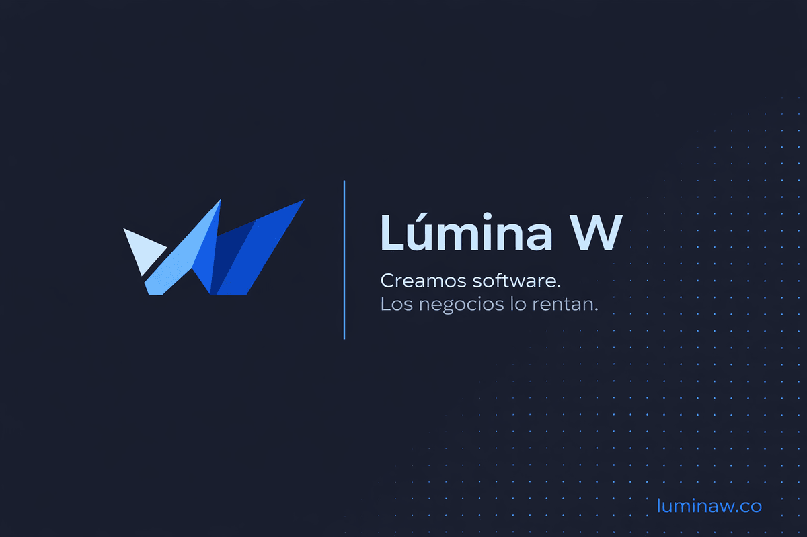

<h1 align="left">
  
  Valentina Ramírez • @wavival
</h1>

Currently developing **TerraCore**, a B2B SaaS platform for the agroindustrial sector in Colombia, built with Python, Django REST Framework, PostgreSQL, and React.

> Trained in cybersecurity (Diploma in Cybersecurity • EAFIT • SOC Operations), on a clear path toward **Application Security and DevSecOps**.

## Contents

- [Projects](#projects)
  - [TerraCore](#terracore)
  - [OKroot](#okroot)
  - [NullBreach](#nullbreach)
  - [Blog Lúmina W](#blog-lúmina-w)
  - [wavival.dev](#wavivaldev)
  - [Lúmina W](#lúmina-w)
  - [Forgotten Portal](#forgotten-portal)
- [Contact](#contact)

## Projects

### TerraCore

Plataforma multiusuario y offline-first para fincas colombianas. Centraliza animales, cultivos, insumos, herramientas, producción, salud animal y finanzas; los módulos están conectados, por lo que una acción en campo actualiza los registros relacionados. Reemplaza cuadernos, hojas de cálculo y grupos de WhatsApp con permisos por sede y roles de administrador, operario y colaborador.

La [landing](https://www.terracoreapp.co/) presenta el producto y la [app](https://app.terracoreapp.co/) permite operar sin señal. Está construida con Django 6, DRF y PostgreSQL 16 en el backend, y React 19, TypeScript, Vite, Tailwind CSS 4 y Dexie en el cliente. El Service Worker, IndexedDB y una cola de salida sincronizan escrituras cuando vuelve la conexión; Celery y Redis gestionan alertas y cobros. Incluye multitenancy desde JWT, sincronización con control de versiones e importación y exportación CSV.

[Landing](https://www.terracoreapp.co/) • [App](https://app.terracoreapp.co/) • [Caso de estudio](https://www.wavival.dev/proyectos/terracore) • [Prototipo](https://terracore-pwa-prototype.netlify.app/)

### OKroot

Aplicación de seguridad alimentaria para personas con celiaquía, diabetes o intolerancia a la lactosa, incluso cuando combinan condiciones. El scanner analiza una foto de la etiqueta y devuelve si el producto es apto, requiere cuidado o no es apto, con el ingrediente determinante, riesgo de trazas y macros. También integra diario de comidas, bitácora de salud, recetas, insights y mercado semanal.

La [landing](https://okroot.co/) explica el producto y la [app](https://app.okroot.co/) guarda registros sin conexión. Su stack combina React 18, TypeScript, Vite, Tailwind CSS 4, Zustand, TanStack Query y Dexie con Django 5.1, DRF y PostgreSQL. El backend valida las imágenes, consulta Claude API con el perfil de salud y reglas duras para ingredientes prohibidos, y descarta la foto después del análisis. Incluye sincronización idempotente, cuotas atómicas de escaneos, pagos con Stripe y Mercado Pago, JWT con refresh rotativo y controles de seguridad en Nginx y DRF.

[Landing](https://okroot.co/) • [App](https://app.okroot.co/) • [Caso de estudio](https://www.wavival.dev/proyectos/okroot)

### NullBreach

Asistente de seguridad de aplicaciones de código abierto. Una persona con cuenta puede analizar fragmentos de hasta 20.000 caracteres contra criterios OWASP, con severidad, impacto y remediación, o usar un chat de desarrollo seguro. Las consultas y análisis quedan asociados a cada cuenta; la landing pública explica el producto y las rutas privadas concentran la aplicación.

Es una aplicación única con Next.js App Router, React, TypeScript y Prisma Postgres, desplegada bajo `wavival.dev/nullbreach` mediante Vercel Microfrontends. Usa OpenAI Responses API únicamente desde el servidor, NextAuth con credenciales y Google OAuth, recuperación de contraseña por Brevo y autorización en dos capas. La API incluye Swagger UI, OpenAPI y health check; su CI valida formato, tipos, Prisma, pruebas, dependencias y secretos antes de desplegar staging y producción.

[Producción](https://www.wavival.dev/nullbreach/) • [API](https://www.wavival.dev/nullbreach/swagger) • [Repositorio](https://github.com/wavival/nullbreach) • [Caso de estudio](https://www.wavival.dev/proyectos/nullbreach)

### Blog Lúmina W

Plataforma bilingüe de Lúmina W sobre desarrollo web, ciberseguridad y producto digital. Combina publicaciones propias en Markdown con artículos propuestos por la comunidad: cada envío pasa por borrador, revisión, publicación o rechazo. Incluye perfiles, comentarios con hilos, likes, guardados, seguimiento, búsqueda, categorías, newsletter por idioma y panel de moderación.

Está construida con Next.js App Router, React, TypeScript, Tailwind CSS, Prisma, PostgreSQL en Supabase, Supabase Storage, Claude API y Brevo. Los artículos publicados pueden traducirse automáticamente entre español e inglés; el Markdown se sanitiza antes de renderizarse y las imágenes se verifican por firma, transforman a WebP y se almacenan con límites por uso. Incluye CSP con nonce, limitación de frecuencia atómica, validación de origen, sitemap, RSS, JSON-LD y `llms.txt`.

[Producción](https://blog.luminaw.co/) • [Caso de estudio](https://www.wavival.dev/proyectos/blog-lumina-w)

### wavival.dev

Portafolio bilingüe y caso de diseño construido alrededor de `@wavival | Design System v4`. Español se publica en la raíz e inglés bajo `/en`; los proyectos, el stack y sus rutas localizadas salen de contenido tipado. Su sistema editorial usa reglas de 1 px, índices numerados, una señal azul y contraste AA en ambos temas, con accesibilidad como restricción de diseño.

La producción estática usa Astro 7, TypeScript y Tailwind CSS con tokens propios; el JavaScript de cliente se limita al tema, menú y filtros. Incluye JSON-LD, Open Graph por proyecto, `sitemap`, `hreflang`, `llms.txt`, fuentes autoalojadas, View Transitions, CSP por hashes y una función serverless para cotizaciones con Brevo. Se despliega en Vercel junto a NullBreach mediante microfrontends y mantiene calidad con Playwright, Lighthouse CI, verificación de enlaces y commitlint.

[Producción](https://www.wavival.dev/) • [Caso de estudio](https://www.wavival.dev/proyectos/wavival-dev) • [Prototipo](https://wavival-prototype.netlify.app/) • [Repositorio](https://github.com/wavival/wavival.dev)

### Lúmina W

Empresa de software B2B que crea software a medida, automatizaciones y sistemas digitales para empresas que necesitan operar sin procesos manuales. Su landing presenta los servicios y productos de Lúmina W para Colombia.

El sitio está publicado con Astro y ofrece versiones en español e inglés, con metadatos Open Graph, datos estructurados, `sitemap` y `llms.txt` para descubrimiento.

[Producción](https://luminaw.co/)

### Forgotten Portal

Ejercicio de pentesting sobre una máquina DockerLabs en un entorno controlado, de acceso inicial a root. Documenta reconocimiento, enumeración, explotación de una carga PHP sin validar, reverse shell y escalamiento de privilegios; el alcance se limita al contenedor de laboratorio con Apache y OpenSSH.

Se ejecutó con metodología PTES y herramientas como Nmap, Gobuster, Netcat y Python. El proyecto reúne siete hallazgos con severidad, CVSS v3.1, CWE, evidencia y remediación, además del mapeo a MITRE ATT&CK y una matriz de riesgo basada en ISO/IEC 27005. Incluye un informe técnico, uno ejecutivo y 28 capturas anotadas para que el ejercicio sea reproducible.

[Writeup](https://blog.luminaw.co/forgotten-portal-pentesting-dockerlabs/) • [Repositorio](https://github.com/wavival/forgotten-portal-writeup) • [Caso de estudio](https://www.wavival.dev/proyectos/forgotten-portal)

## Contact

 **Valentina Ramírez · @wavival**

> Thanks for getting here. Let's build great things.

