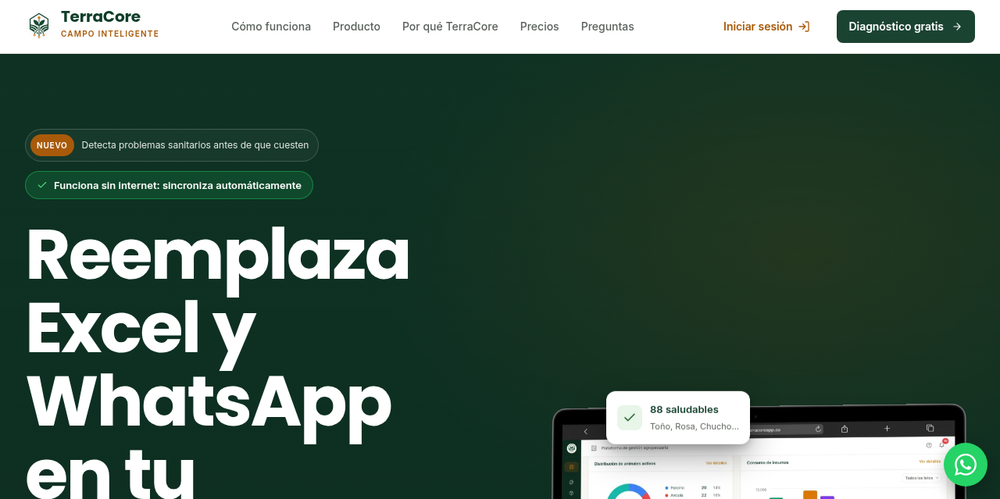
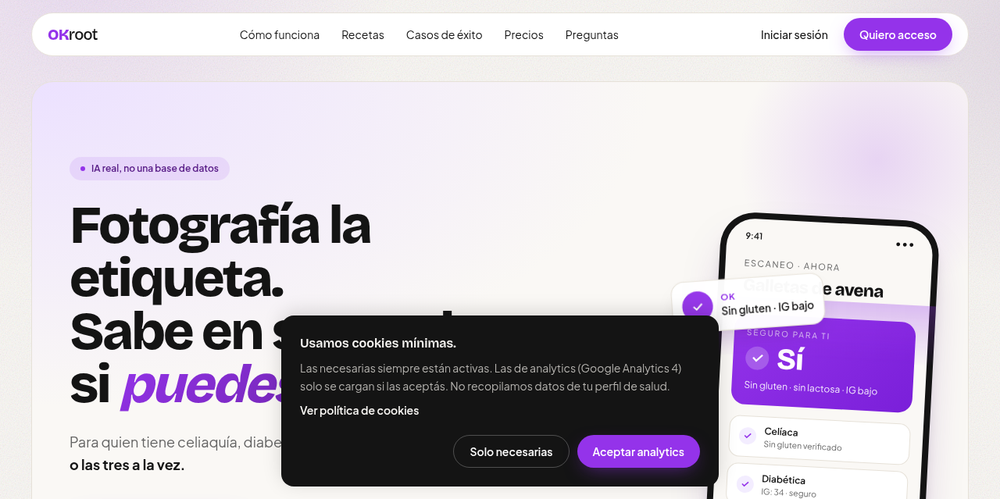
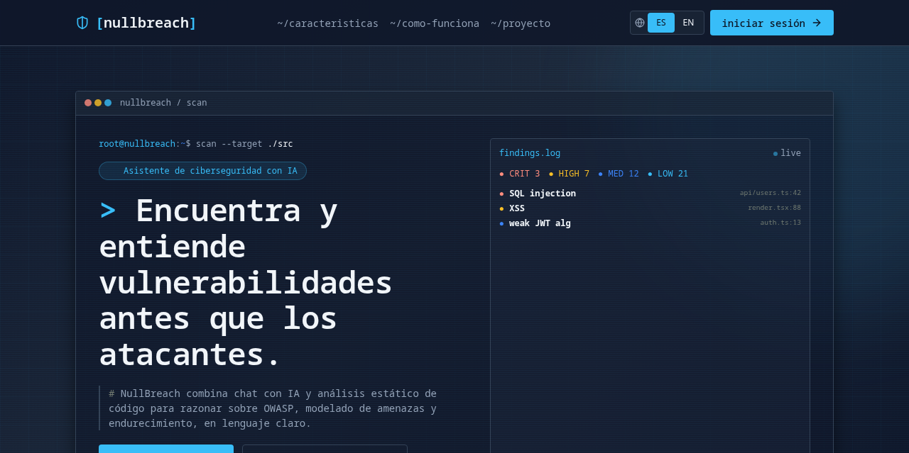
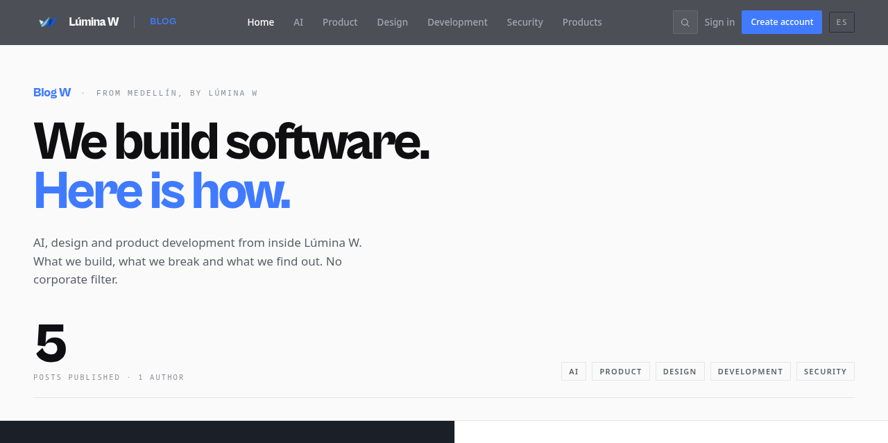
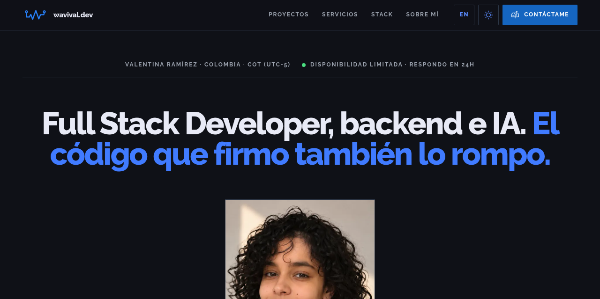
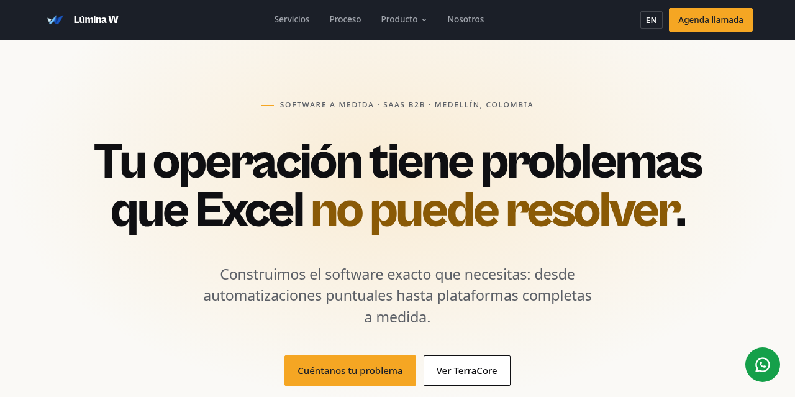
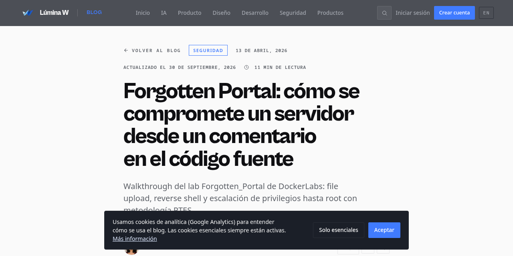

<h1 align="left">
  
  Valentina Ramírez • @wavival
</h1>

Currently developing **TerraCore**, a B2B SaaS platform for the agroindustrial sector in Colombia, built with Python, Django REST Framework, PostgreSQL, and React.

> Trained in cybersecurity (Diploma in Cybersecurity • EAFIT • SOC Operations), on a clear path toward **Application Security and DevSecOps**.

## Contents

- [Projects](#projects)
  - [TerraCore](#terracore)
  - [OKroot](#okroot)
  - [NullBreach](#nullbreach)
  - [Blog Lúmina W](#blog-lúmina-w)
  - [wavival.dev](#wavivaldev)
  - [Lúmina W](#lúmina-w)
  - [Forgotten Portal](#forgotten-portal)
- [Contact](#contact)

## Projects

### TerraCore

Multi-user, offline-first farm management platform for Colombia. It centralizes livestock, crops, inventory, equipment, production, animal health, and finances. Connected modules keep operational data consistent across the farm, while site-level roles and permissions replace notebooks, spreadsheets, and WhatsApp groups.

The public site explains the product, while the app supports field operations without a connection. The stack combines Django, Django REST Framework, PostgreSQL, Celery, Redis, React, TypeScript, Vite, Tailwind CSS, and Dexie. Service Workers, IndexedDB, and an outbox synchronize writes when connectivity returns; the platform also includes JWT-based multitenancy, versioned sync, and CSV import and export.

<a href="https://www.terracoreapp.co/" target="_blank" rel="noopener noreferrer">View site</a> · <a href="https://app.terracoreapp.co/" target="_blank" rel="noopener noreferrer">View app</a> · <a href="https://www.wavival.dev/proyectos/terracore" target="_blank" rel="noopener noreferrer">Case study</a>

### OKroot

Food-safety app for people with celiac disease, diabetes, or lactose intolerance, including combined conditions. Its scanner analyzes a product-label photo and returns a safe, caution, or unsafe verdict with the deciding ingredient, cross-contamination risk, and nutrition data. It also includes a food journal, health log, recipes, insights, and a weekly grocery list.

The public site presents the product and the app preserves records offline. React, TypeScript, Vite, Tailwind CSS, Zustand, TanStack Query, and Dexie power the client; Django, Django REST Framework, and PostgreSQL power the backend. Claude API evaluates labels against the persistent health profile and hard rules for excluded ingredients. The platform also provides idempotent sync, atomic scan quotas, Stripe and Mercado Pago payments, rotating JWT refresh tokens, and security controls in Nginx and DRF.

<a href="https://okroot.co/" target="_blank" rel="noopener noreferrer">View site</a> · <a href="https://app.okroot.co/" target="_blank" rel="noopener noreferrer">View app</a> · <a href="https://www.wavival.dev/proyectos/okroot" target="_blank" rel="noopener noreferrer">Case study</a>

### NullBreach

Open-source application-security assistant. Authenticated users can submit code snippets of up to 20,000 characters for OWASP-aligned analysis with severity, impact, and remediation guidance, or use a secure-development chat. Queries and analyses are stored per account.

The application uses Next.js App Router, React, TypeScript, Prisma Postgres, NextAuth, and the OpenAI Responses API exclusively from the server. It is deployed under `wavival.dev/nullbreach` through Vercel Microfrontends, with credential and Google OAuth login, password recovery through Brevo, two-layer authorization, Swagger UI, OpenAPI, and a health endpoint. CI validates formatting, types, Prisma, tests, dependencies, and secrets before staging and production deployments.

<a href="https://www.wavival.dev/nullbreach/" target="_blank" rel="noopener noreferrer">View app</a> · <a href="https://www.wavival.dev/nullbreach/swagger" target="_blank" rel="noopener noreferrer">API</a> · <a href="https://github.com/wavival/nullbreach" target="_blank" rel="noopener noreferrer">Repository</a> · <a href="https://www.wavival.dev/proyectos/nullbreach" target="_blank" rel="noopener noreferrer">Case study</a>

### Blog Lúmina W

Bilingual platform by Lúmina W for web development, cybersecurity, and digital-product writing. It combines repository Markdown posts with community-submitted articles that move through draft, review, publication, or rejection. The product includes profiles, threaded comments, likes, saved posts, following, search, categories, language-specific newsletters, and moderation tools.

Built with Next.js App Router, React, TypeScript, Tailwind CSS, Prisma, PostgreSQL on Supabase, Supabase Storage, Claude API, and Brevo. Published posts can be automatically translated between Spanish and English; Markdown is sanitized before rendering, and uploaded images are signature-checked, converted to WebP, and stored with usage-specific limits. The platform includes CSP with nonce, atomic rate limiting, origin validation, sitemap, RSS, JSON-LD, and `llms.txt`.

<a href="https://blog.luminaw.co/" target="_blank" rel="noopener noreferrer">View site</a> · <a href="https://www.wavival.dev/proyectos/blog-lumina-w" target="_blank" rel="noopener noreferrer">Case study</a>

### wavival.dev

Bilingual portfolio and design case built around `@wavival | Design System v4`. Spanish is published at the root and English under `/en`; projects, stack entries, and localized routes are generated from typed content. Its editorial system uses 1 px rules, numbered indexes, a single blue signal, and AA contrast in both themes, with accessibility treated as a design constraint.

The static production site uses Astro, TypeScript, and Tailwind CSS with custom tokens. Client-side JavaScript is limited to theme, navigation, and filters. It includes JSON-LD, project-specific Open Graph metadata, sitemap, hreflang, `llms.txt`, self-hosted fonts, View Transitions, hash-based CSP, and a Brevo-powered serverless quote form. Vercel deploys it alongside NullBreach through microfrontends, with Playwright, Lighthouse CI, link checks, and commitlint as quality gates.

<a href="https://www.wavival.dev/" target="_blank" rel="noopener noreferrer">View site</a> · <a href="https://github.com/wavival/wavival.dev" target="_blank" rel="noopener noreferrer">Repository</a> · <a href="https://www.wavival.dev/proyectos/wavival-dev" target="_blank" rel="noopener noreferrer">Case study</a>

### Lúmina W

B2B software company building custom software, automations, and digital systems for companies that need to move beyond manual processes. Its public site presents Lúmina W's services and products for Colombian businesses.

The bilingual site is published with Astro and includes Open Graph metadata, structured data, sitemap, and `llms.txt` for discovery.

<a href="https://luminaw.co/" target="_blank" rel="noopener noreferrer">View site</a>

### Forgotten Portal

Penetration-testing exercise against a DockerLabs machine in a controlled environment, from initial access to root. It documents reconnaissance, enumeration, exploitation of an unvalidated PHP upload, reverse shell, and privilege escalation; the scope is limited to a laboratory container running Apache and OpenSSH.

The work follows the PTES methodology and uses Nmap, Gobuster, Netcat, and Python. It documents seven findings with severity, CVSS v3.1, CWE, evidence, and remediation, plus MITRE ATT&CK mapping and an ISO/IEC 27005-based risk matrix. The repository includes technical and executive reports and 28 annotated screenshots to make the exercise reproducible.

<a href="https://blog.luminaw.co/forgotten-portal-pentesting-dockerlabs/" target="_blank" rel="noopener noreferrer">Write-up</a> · <a href="https://github.com/wavival/forgotten-portal-writeup" target="_blank" rel="noopener noreferrer">Repository</a> · <a href="https://www.wavival.dev/proyectos/forgotten-portal" target="_blank" rel="noopener noreferrer">Case study</a>

## Contact

 **Valentina Ramírez · @wavival**

> Thanks for getting here. Let's build great things.

